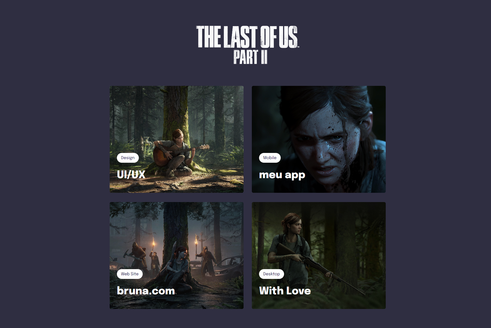
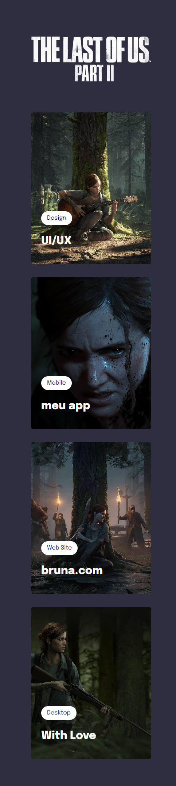

  <h1 align="center">Projeto 05 - Ellie Williams 🏹</h1>

## ✏️ Sobre

> Projeto simples e responsivo desenvolvido para aplicar conceitos aprendidos nas aulas do Stage 03 da Rocketseat 🚀

> Customizado com o tema do jogo The Last of Us part II 🎨

✔ grid layout

✔ filtros de imagem

✔ transform/transition

✔ manipulação de cores HSL

✔ variáveis css

✔ animações css

✔ css clamp

## 💻 Desktop

## 📲 Mobile

## 🚀 Tecnologias

- HTML
- CSS

[🔗 Clique aqui para acessar](https://brunakarina.github.io./project-ellie/)

## 📫 Contato

  
  

 

<h4 align="center">Made with ❤ by Bruna Karina 👋🏻</h4>
